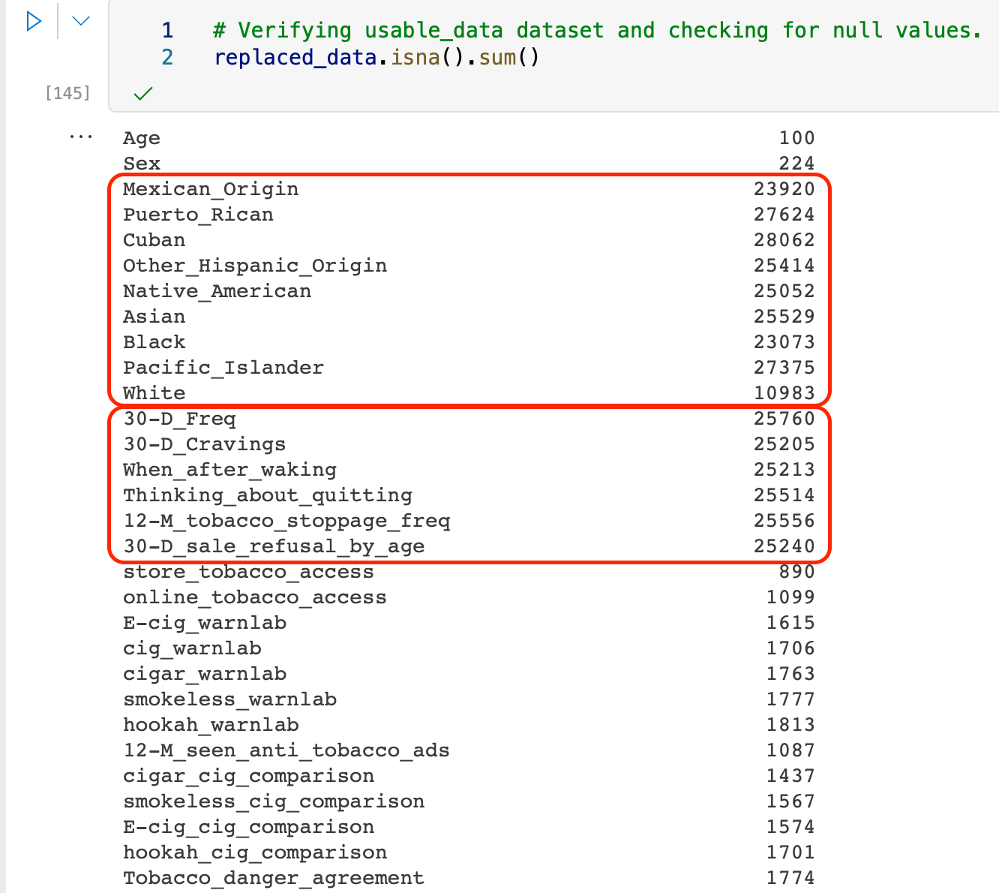
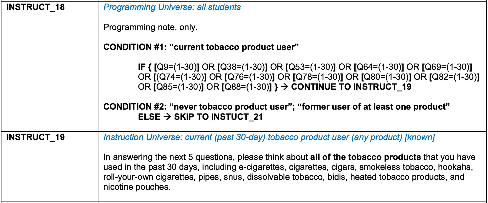
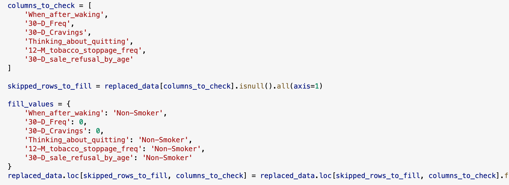
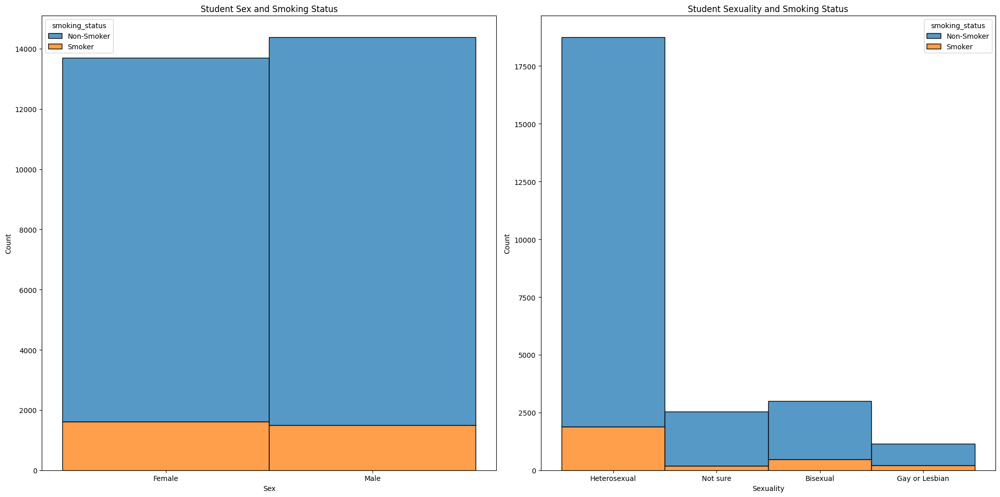
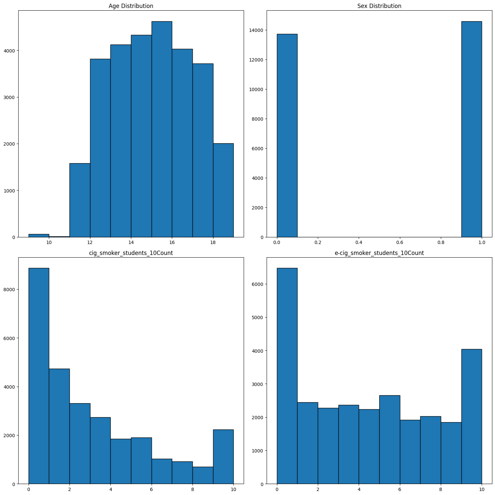
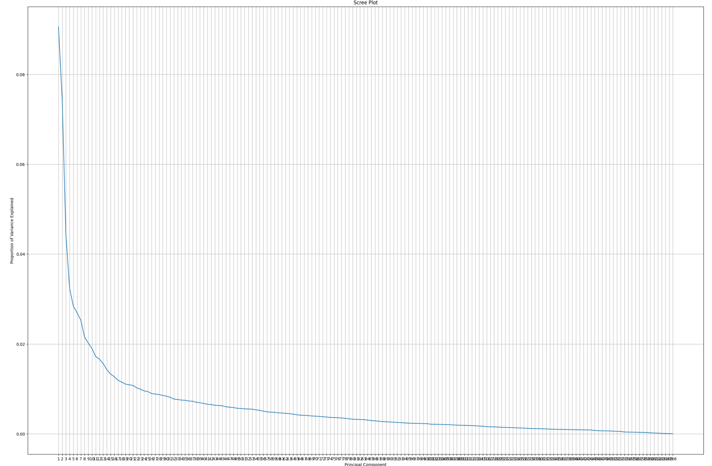
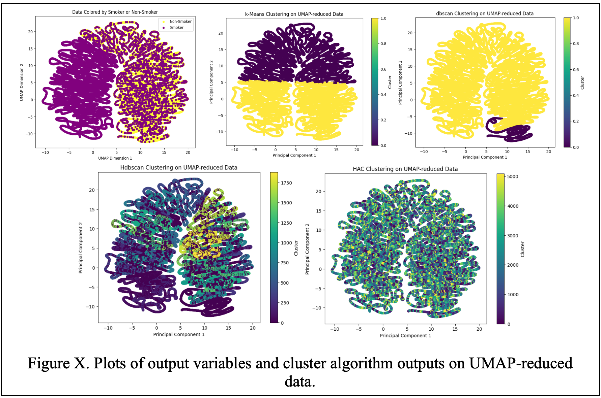
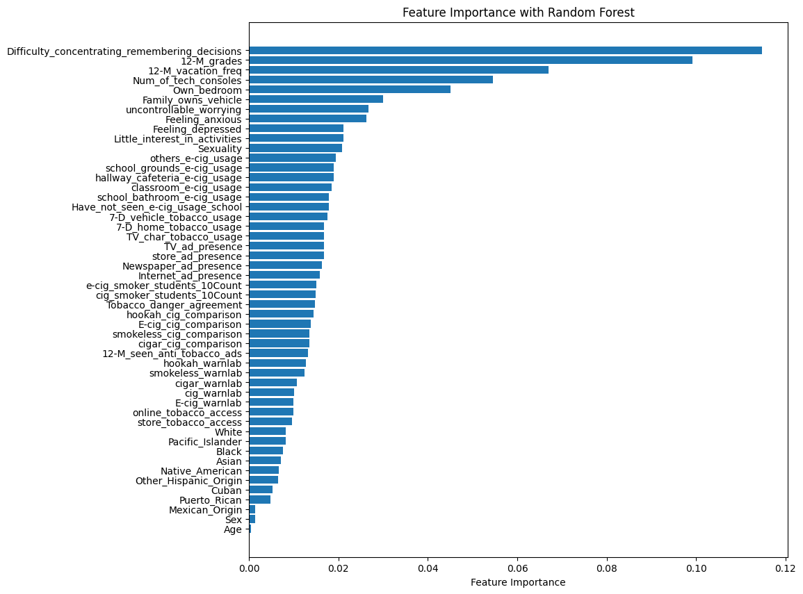

# Leveraging environmental, socio-economic and sexuality data to predict smoking status of teenagers. 

## Team Members 
Shreyas Kashyap - (sskashya)

Dana Adcock - (danaadcock)

Arunava Das - (AD0507)

Rajat Rohilla - (Rajat-Rohilla)

## 1. Introduction
Tobacco consumption among underage individuals remains a significant public health concern globally. Despite stringent regulations and public awareness campaigns, a considerable number of adolescents continue to experiment with tobacco products, including cigarettes and smokeless tobacco. Studies indicate that early exposure to nicotine can lead to long-term addiction, and those who begin smoking at a young age are more likely to continue into adulthood. Environmental, social, and economic factors also play a critical role in influencing an adolescent's decision to start using tobacco.

In response to the ongoing issue of underage tobacco use, this project utilizes data from the National Youth Tobacco Survey (NYTS) to explore the determinants of tobacco consumption among youth. The survey, which involved 28,291 students from 341 schools across the nation, provides insights into various aspects of tobacco use and its prevalence across different demographic groups. By focusing on a subset of general tobacco-related questions that cover environmental exposure, socio-economic status, and other relevant factors, the project aims to predict patterns of tobacco use and identify effective factors and leverage them to prevent tobacco consumption among teenagers. Through this project, a new survey will be designed for teenagers to participate in and will not require self-confession of tobacco consumption. This research is vital for stakeholders such as educators, parents, policymakers, and anti-tobacco advocates who are working together to combat the issue of tobacco consumption in underage populations. Educators and anti-tobacco advocates can leverage data from the newly designed survey, to target groups of participants based on the prevaling factors, and provide specialized education materials to help reduce underage tobacco consumption in America. 

The hypothesis for this project is that socio-economic, environmental, behavioral (such as lack of interest, uncontrollable worrying, etc.), sexuality and race factors are key determinants of whether a teenager is likely to participate in underage tobacco consumption. 

---
## 2. Literature Review
How underaged Americans obtain and consume nicotine is a hot topic in health, education, and policy sectors. From 2011 to 2018, researchers reported a significant increase in tobacco product use among US middle and high school students, emphasizing the urgency for targeted interventions *(Cullen et al., 2018; Gentzke et al., 2019)*. They reiterated the persistence of tobacco use among youth, stressing the necessity for more effective prevention strategies and continuous monitoring *(Singh et al., 2016; Wang et al., 2018)*.  

The long-term health implications of e-cigarettes are still being investigated, but studies have started documenting severe physical and mental health warnings. Vaping may be associated with heart and lung issues and seizures *(Becker & Rice, 2021)*. E-cigarette consumption also impacts mental health. Vaping is consistently associated with depression, suicidal ideation, ADHD, and conduct disorder in adolescents *(Becker & Rice, 2021)*. 
Additionally, electronic cigarette use may lead to cigarette smoking among adolescents, suggesting the importance of addressing this potential gateway effect *(Bunnell et al., 2015)*. Youth susceptibility to tobacco use overlaps with other risky behaviors, such as other tobacco products, cannabis, and alcohol use *(Becker & Rice, 2021; Cheng et al., 2021)*. Nicotine alerts neural pathways associated with reward and may increase long-term neural sensitivity to other psychoactive drugs through adulthood *(Becker & Rice, 2021)*. 

Approximately, one-quarter of high school senior smokers reported starting before grade 6, and approximately one-half by grade 7 or 8 *(Tracy Orleans C, 1993)*. Despite increased legislation against underage purchasing of e-cigarettes, some adolescents have turned to online ordering to bypass age restrictions. They may not even know the contents of their smoking device. 40% of students who reported smoking nicotine-free devices had the substance detected in their urine *(Boykan et al, 2019)*. For youth that cannot buy online, cigarettes may be substituting e-cigarette use *(Abouk et al., 2023)*. Overall, taxes on electronic delivery systems of nicotine decreased electronic use in youth but increased cigarette use *(Abouk et al., 2023)*. There is an increasing need for a comprehensive understanding of the determinants of tobacco use among youth and the development of tailored prevention and cessation programs *(Wang et al., 2019)*. 

The National Youth Tobacco Survey (NYTS), administered by the Centers for Disease Control and Prevention (CDC), serves as a crucial instrument for gathering detailed data on tobacco consumption among middle and high school students across the United States. This survey encompasses a broad array of topics such as the prevalence and frequency of cigarette smoking, the use of smokeless tobacco products, and efforts to quit smoking. By leveraging data from the 2022 NYTS, this project applies clustering and classification techniques to identify the key factors influencing youth tobacco consumption. A better understanding of the factors that play an important role in tobacco consumption from this analysis will empower stakeholders—including educators, parents, policymakers, and anti-tobacco advocates—to develop targeted, data-driven strategies to reduce tobacco use among adolescents. 

--- 
## 3. Data and Methods
This section will describe the team's data set, its credibility and the various methods undertaken to understand, load and transform the data into an efficient predictive model. 

A comprehensive understanding of how the survey was programmed and domain research was necessary for the development of scope and data cleaning. Here is a brief overview of the methods used:

    1. Basic statistical analysis using .describe()

    2. Data Segmentation for imputation due to class imbalance.

    3. Data Encoding (Label and One-Hot)

    4. Utilizing SMOTE() to overcome class imbalance issues. 

    5. Dimensionality Reduction techniques such as KernelPCA() and UMAP. 

    6. Clustering Analysis using k-means Clustering, HAC, DBscan and HDBscan. 

    7. Feature Importance and Permutation Feature Importance. 

#### 3.1 Data
For this project, the team applied data collected by the National Youth Tobacco Survey (NYTS). The NYTS was designed to produce national estimates at a 95% confidence level by school level, grade, sex, and race and ethnicity. 341 national public and private schools participated in this survey and 28,291 student questionnaires were completed. This dataset utilized comprised of questionnaires from 2022 and can be found at CDC's website: https://www.cdc.gov/tobacco/data_statistics/surveys/nyts/data/index.html 

The original and raw dataset comprised of 28,291 rows and 1334 columns. The survey consisted of individual tobacco product consumption along with generalized tobacco consumption questions. Due to the complexity of pre-processing, the group decided to pull a subset of survey questions that focused on general tobacco questions. These general tobacco consumption questions comprised of environmental, socio-economic, racial and sexuality questions. Examples of these questions are the following:

Environmental: 

    - Have you seen tobacco consumed by an on-screen character?
    - How many days in the past 7 days has someone consumed tobacco at home?

Socio-economic: 

    - Does your family own a vehicle?
    - Do you have your own bedroom?

Initially, during the loading of raw data, the team discovered that the .csv file consisted of already encoded data. This made it extremely difficult to understand the data. This required recoding the encoded data from the NYTS codebook in order to understand what the data values for these questions were. Recoding of the raw data lead to the discovery of multiple columns having significant amounts of NULL values. 

***Figure 3.1.1**: The red boxes highlight the significance of null values in the data.*

The null values from the race columns (*'Mexican_Origin', 'Puerto_Rican', etc.*) represent '0' since these columns are in a one-hot encoded format. These columns were easy to impute. However, the red box highlighting columns from *'30-D_Freq' to '30-D_sale_refusal_by_age'* show that almost 90% of those columns were missing. These null values could be missing completely at random (MCAR) or missing not at random (MNAR). Upon further investigation, the team discovered that these values were missing not at random due to the survey being programmed a specific way. 

***Figure 3.1.2**: Image shows programming instructions on how the survey was conducted.*

Figure 3.1.2 shows how the programming instructions created missing values in the data for these columns. Essentially, if survey participant made a selection in previous questions, indicating that they had consumed at least one of the tobacco products in the past 30 days, they were classified as a 'Smoker'. However, if they did not make a selection, they were classified as a current 'Non-smoker'. The survey than skips questions *'30-D_Freq' to '30-D_sale_refusal_by_age'* for those classified as 'Non-smokers'. With this information, the team was able to impute these null values with the appropriate values for each column. 

***Figure 3.1.3**: Image shows code written for imputation. 

If all the columns in *'columns_to_check'* were null for that row, that participant was considered a non-smoker and the null values were imputed accordingly. This led to the discovery of a sever class imbalance being present in the data set. About 90% of the dataset were 'non-smokers' and the rest were 'smokers'. This imbalance can be seen in **Figure 3.1.4** below. 

***Figure 3.1.4**: Image shows the class imbalance within the dataset between the two smoking_status classes. 

Further imputation of other columns, exploratory data analysis and pre-processing measures taken for survey data from NYTS will be talked about in detail in the Methods section. 
#### 3.2 Methods
**Forewarning** - A custom kernel Python (aml707) was created for Tobacco_ETL.ipynb. During this process, the pandas version and matplotlib version were incompatible resulting in the need for adjusting code accordingly. More information can be found in this forum: https://stackoverflow.com/questions/75939123/valueerror-multi-dimensional-indexing-e-g-obj-none-is-no-longer-suppor
##### Imputation and cleaning the dataset
Once those columns that were mentioned in the above section 3.1 Data, were imputed, feature engineering was conducted to create a new feature called ‘smoking_status’. If  a record in *'30-D_Freq'* had a value of 0, it indicated a Non-smoker class hence, reflecting accordingly in the smoking_status feature. Similarly, if a record in *’30-D_Freq’* had a value greater than 0, it would assign ‘smoker’ for that record in the smoking_status feature. As seen in the Data section 3.1, class imbalance was prevalent in the data and this would have severely impacted the imputation for missing values in other columns/ questions that fell in the socio-economic, environmental and sexuality categories. To prevent any influence from the majority class during imputation, the dataset was split into 2 different datasets: *smoker_df* and *non_smoker_df*. The null values were then imputed with the most-frequent value from that column in each dataset. This can be referred to in the ***Imputation Section in the Jupyter Notebook linked below:*** 

Tobacco_ETL.ipynb url - 

Outliers with thus dataset was not a concern due to the survey designed to be a multiple choice questionnaire. Therefore, there was no requirement for outlier detection algorithms. 
##### Data Leakage and Label Encoding
With both the smoker_df and the non-smoker_df datasets cleaned, it was important to shuffle the rows post-merging of data, to prevent unseen training or testing data when building the model later on. After both the datasets were merged into a dataset saved as *'clean_data'*, it was crucial to split the data into **X** (*‘clean_predictors’*) and **Y** (*’clean_target’*) for encoding and resampling in later stages. The team then utilized vizualizations to explore the distributions of certain columns. 

***Figure 3.2.1**: The image shows the distribution of a few columns from the dataset. 

However, data transformation seemed redundant due to the foresight of utilizing decision tree and tree ensemble algorithms as our predictive models. 

This next data manipulation method required the team to go back and forth with our EDA and our predictive modeling stages. Essentially, those columns that were a deciding factor for whether a participant was a smoker or non-smoker were directly correlated with the outcome, *‘smoking_status’*. This resulted in data leakage and cross_validation scores during the modeling stages were 1.0. 

Therefore, the team dropped the questions ’30-D_Freq’, ’30-D_Cravings’ once smoking status of each participant was determined, and then proceeded with label encoding the *‘clean_predictors’* data. Initially, label encoding the ‘object’ data-types required fitting the encoder with each column and iterating through the columns in the ‘clean_predictors’ data set. 
	
    cat_data = clean_predictors.select_dtypes('object')
    le = LabelEncoder()
    for column in cat_data:
        clean_predictors[column] = le.fit_transform(clean_predictors[column])

However, this strategy was not ideal for pre-processing new data in the future. It was discovered that the label encoder only saved the labels from the last iterated column. Hence, the output for **le.classes_** was {[‘Yes’, ‘No’]}. In order to transform future survey data through encoding, the team required the encoder to ‘remember’ the labels from each column. Therefore, a dictionary was created to associate the label encoder classes to each column. 

    cat_data = clean_predictors.select_dtypes('object')
    label_encoders = {}

    for column in cat_data:
        le = LabelEncoder()
        le.fit(clean_predictors[column])
        label_encoders[column] = le

    for column in cat_data:
        clean_predictors[column] = label_encoders[column].transform(clean_predictors[column])

This can be referred to in the ***Label Encoding Section in the Jupyter Notebook linked below:*** 

Tobacco_ETL.ipynb url -
##### Fixing Class Imbalance issues
With the data encoded appropriately, it was ready for resampling in order to fix the imbalance between classes. A dataset with imbalanced classes would result in model overfitting and difficulty in learning minority patterns. In order to prevent building an unreliable model, resampling the data was a crucial part of data pre-processing. The team applied SMOTE() from the ***imblearn*** module to resample clean_predictors. The new data was then saved as '*x_resampled* ' and '*y_resampled* ' and the shape of the predictor variables (x_resampled) were (50321, 50) and the shape of the target variable (y_resampled) was (50321, 1). This can be referred to in the ***Fixing class-imbalance issues Section in the Jupyter Notebook linked below:*** 

Tobacco_ETL.ipynb url -

#### Dimensionality Reduction and One-Hot Encoding
Once the data was pre-processed and transformed, it was important to explore the structureal dynamics of the dataset using various cluster analysis. In order to pursue clustering, dimensionality reduction on the data was neccessary and to avoid any assumptions of the linearity of the data, the team adopted kernelPCA and UMAP as reduction techniques. 

Dimensionality reduction, however, works on the assumption that numerical values in each column correlate to each other and groups columns together based on their variance with each other. The issue with using label encoded data for dimensionality reduction is that each column's numerical value is associated with a label/ category within that column and has no association with the label/ category from another column. In simpler terms, if column 1 has a value 0 that is associated with the label 'Male', it is not likely to have any relation with column 2's value 0 which is associated with the label 'Yes'. However, dimensionality reduction algorithms will assume that there is no variance between these two values and group them together. Therefore, making label encoded data ineligible and unreliable for dimensionality reduction techniques. 

"Center the data around the origin by subtracting the mean of each feature from the data points. Calculate the covariance matrix, which captures how each feature varies with every other feature."

Introne, J. 2024. 1-dimensionality-reduction [Jupyter Notebook]. Github. [https://github.com/IST407-707/707-lecture-master/blob/main/8-week8/1-dimensionality-reduction.ipynb](https://github.com/IST407-707/707-lecture-master/blob/main/8-week8/1-dimensionality-reduction.ipynb)

In order to pursue clustering analysis, the data required re-encoding. A copy of *'clean_data'* was made to preserve the label encoded data and was transformed into one_hot_encoded data. The number of features increased from 50 to 166 features. This can be referred to in the ***One Hot Encoding Section in the Jupyter Notebook linked below:*** 

Tobacco_ETL.ipynb url -  

##### UMAP, KernelPCA and Clustering
The transformation of the dataset to one-hot encoded data allowed the team to begin exploring various number of components to reduce dimensions to. The algorithm, kernelPCA() from sklearn.decompose was utilized to plot a scree plot with no *n_components* argument. A scree plot essentially visualizes variance explained across components and the elbow method is typically used to decide the number of components the data should ideally be reduced to. The elbow method represents the point or the 'kink' in the curve where the variance among compnents starts to level off implying that any additional component will be of very little to no benefit, on the performance of the predictive model. 

***Figure 3.2.2**: This image shows the variance explained across 166 components from the **one hot encoded data**.* 

Since the 'elbow' was not clear in the scree plot, and due to the nature of redesigning the NYTS survey, the team decided to abandon the vision of dimensionality reduction for predictive modeling. With respect to redesigning the survey, in order to understand which questions have been grouped or binned together, it would required extensive analysis across 166 components. However, each column/ feature in the one hot encoded data, is an answer from each survey question with the first answer dropped to prevent multi-colinearity. Therefore, aggregating features together in different bins could prove to be confusing and detrimental to the credibility of the reduced dataset. The kernelPCA() analysis can be referred to in the ***Dimensionality Reduction Section in the Jupyter Notebook linked below:*** 

Tobacco_ETL.ipynb url - 

Instead of applying dimensionality reduced data to the training of the predictive model, the team focused on applying it to exploring the structural dynamics of the dataset through clustering. The team reduced data dimensionality using UMAP, which was preferable over PCA due to its compatibility with non-linear data. Different hyperparameters were explored and the following were the best for fitting the data: **n_components = 2**, **n_neighbors = 15**, and **min_dist = 0.1**. The team fit four different clustering algorithms to the UMAP-reduced data: **k-means (n_clusters = 2)**, **HAC (distance_threshold = 0.5, linkage = ‘ward’)**, **DBScan (eps = 0.3, min_samples = 5)**, and **HDBscan (min_samples = 5, min_cluster size = 5)**. The original data was indexed with the reduced data to merge with the output variables. Visualization techniques were the applied to the reduced data and corresponding output variables (smoker or non-smoker) for comparison with the clusters from the four different algorithms.The clustering code chunks can be referenced to in the *** Jupyter Notebook linked below:***

ML_Project_Clustering.ipynb url - 

--- 
## 4. Results
###### Clustering Results
The plot of output variables with reduced data demonstrated how intermixed the smoker and non-smoker outputs are. Half of the plot appears to be exclusively smoker, while the other seems to be a split distribution between smoker and non-smoker data. This preliminary visual analysis shows clustering may not be efficient for handling this data, since the divisions are not discrete. **Hierarchal clustering methods** *(HAC and HDBscan)* produced too many clusters (n = 5000 and 1800, respectively) to be relevant or useful for analysis. Although k-means can be set to predict a discrete number of clusters (n = 2), it experienced difficulty finding correct centroids. DBScan was the best fit for the data distribution, likely splitting when smoker data started to be in higher proportion than non-smoker data. However, due to the distribution of the data, other models will likely be better suited to fitting the data than clustering.

***Figure 4.1**: The image shows the various clustering visuals plotted to show the structure of the **one hot encoded data**.*

The clustering code chunks can be referenced to in the *** Jupyter Notebook linked below:***

ML_Project_Clustering.ipynb url - 
##### Feature Importance
Since dimensionality reduction was not an ideal technique to understand the significance of each question, in order to further reduce the space of the data, the team incorporated RandomForest's Feature Importance method. **Label Encoded data was utilized for Feature Importeance analysis**. This provided the team with interesting insight into the influence of certain questions on the outcome. 

***Figure 4.2**: The image shows the importance of each feature on the outcome of a participant's smoking status, ranked from most important to least important.* 

It can be observed that the most important feature only has an importance of 0.12 followed by a series of socio-economic features. It can also be seen how various races have slightly different importance to the outcome of a participant's smoking status. However, those features seem to have extremely low importance, making the team question the influence those features truly have on the smoking status of a participant. Despite gathering interesting information on each feature from the label encoded data, due to an inconclusive insight from the feature importance plot, the team pursued Permutation Feature Importance to understand how the absence of each feature would result in drop in cross-validation score with n_folds at 3. This can be referred to in the ***Model Building Section in the Jupyter Notebook linked below:*** 

Tobacco_ETL.ipynb url -  

While there were a significant number of columns that if were dropped, the cross-validation score would have decreased. However, this decrease was not a significant amount and ranged up to 1% decrease in score. Hence, the team decided to detain all the features. 
##### Choosing the right model
With better understanding of the importance of features on the outcome of smoking status, the team explored 3 different models: **LogisticRegression(solver = 'sag', penalty = 'l2', max_iter = 250)**, **DecisionTreeClassifier(criterion = "gini")**, **RandomForestClassifier(n_estimators = 200, criterion = "gini", random_state = 999999)**. These models were applied to **BOTH** *label encoded data* and *one hot encoded data*.

With respect to the parameters, various parameters were explored before concluding on the ones mentioned above. GridSearchCV was also conducted to find the optimum parameter for *n_estimators*. The team decided on 200 estimators out of [100, 200, 300, 400] due to computation efficiency with running cross-validation metrics for RandomForestClassifier(). Out of the 3 models, RandomForestClassifier provided the best results for both label encoded data and one hot encoded data. 

The cross-validation score between label encoded data (94%) and one hot encoded data (95.5%) was a slight difference of approximately 1.5%. This implied that there was no significant benefit to accuracy from using one dataset over the other. The accuracy score (f1-macro score) for **label encoded** data was 94.96% and 95.74% for **one-hot encoded data** with the RandomForestClassifier algorithm.  This can be referred to in the ***Model Building Section in the Jupyter Notebook linked below:*** 

Tobacco_ETL.ipynb url -  
##### Model Validation
In the end, the team decided to leverage the label encoded data to train the RandomForestClassifier() model due to one reason: The ease of pre-processing single row data before sending it through the saved model for predicting the smoking status of survey participants. 

This was come to light during the team's model validation stage. Based on the 50 questions the model was trained on, a survey was created on GoogleForms. If one person had filled out the survey, the data shape would be (1, 50), If the model relied on one-hot encoded data, there would be many features seen during the fit that would be absent during the prediction of new outcomes. This would result in the team, imputing over a 100 features that are missing, in order to be able to predict the smoking status of a single individual. This could be a tedious process and is highly prone to data leakage and errors. 

Therefore the team decided to implement **label encoded data** in the training of the RandomForestClassifier() model which was then deployed on the validation survey completed by the team. There were 4 submissions in total and the RandomForestClassifier model predicted 3 out of the 4 smoking status correctly. 
## 5. Discussion
The model's ability to perform so well emphasizes the influence socio-economic, sexuality and environmental factors have on underage tobacco consumption. While Race did not show promising importance in the prediction, the other categories of questions was a promising step towards understanding the factors that lead to a teenager to participate in underage tobacco consumption. For example, 'Difficulty_concentrating_or_remembering_decisions' had a feature importance of 0.12, infering how such behavior could be an indicator to a teenager being a smoker. Circling back to the team's stakeholder needs, the team has successfully reduced the number of questions participants would require answering, along with the comfort of not having to disclose their tobacco consumption. Instead the model could raise alerts based on a participants' socio-economic and environmental factors. The team has also successfully emphasized the correlation between the above mentioned factors and smoking status of teenagers, providing anti-tobacco campaigns better understanding on the topic of underage tobacco consumption. 
## 6. Limitations
Despite the model's performance on both the training and test data, and validation data, the team is aware of the risk of working with survey data. While the credibility of the data source is high, survey data depends on the discretion of the participant. Another risk the team could potentially face is the model incorrectly classifying a smoker as a non-smoker. This could result in a participant being neglected on the aid they would likely need to receive. 
## 7. Future Work
With those limitations in mind, the team could potentially validate the model with more validation data to understand the extent to which the model can perform. The team could research other factors such as cravings and location, to further build the features that could improve the accuracy of the model. An interesting avenue to venture into, would be building prediction models with purely environmental factors, and another with purely behavioral factors to understand how each category of factors affect the outcome of a teenager's smoking status. 
